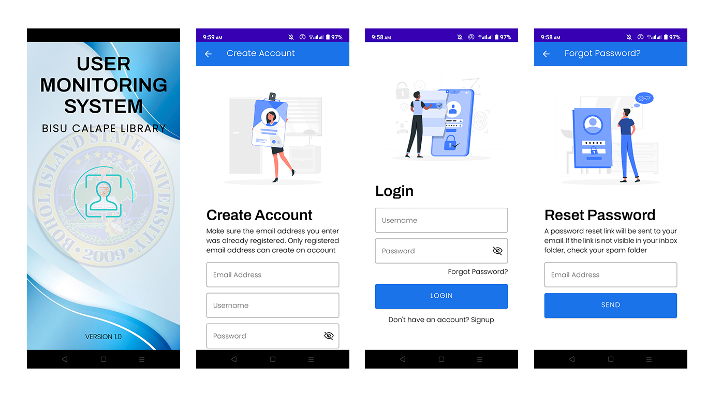
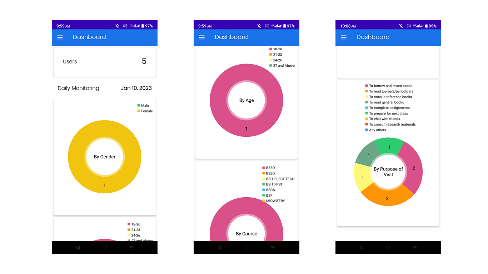
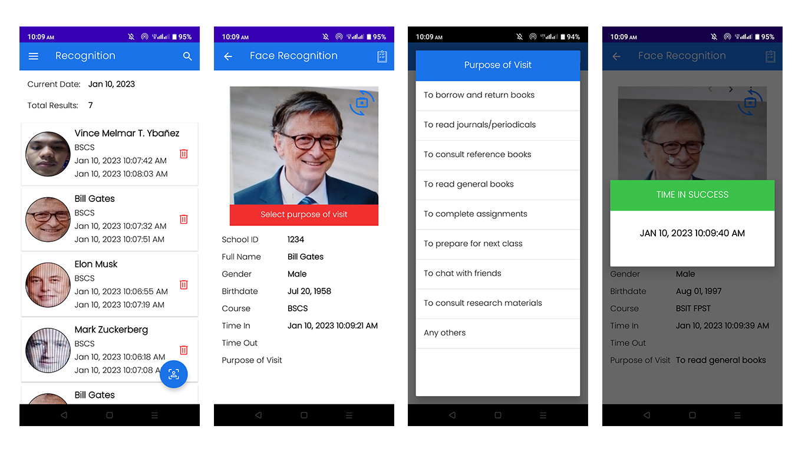
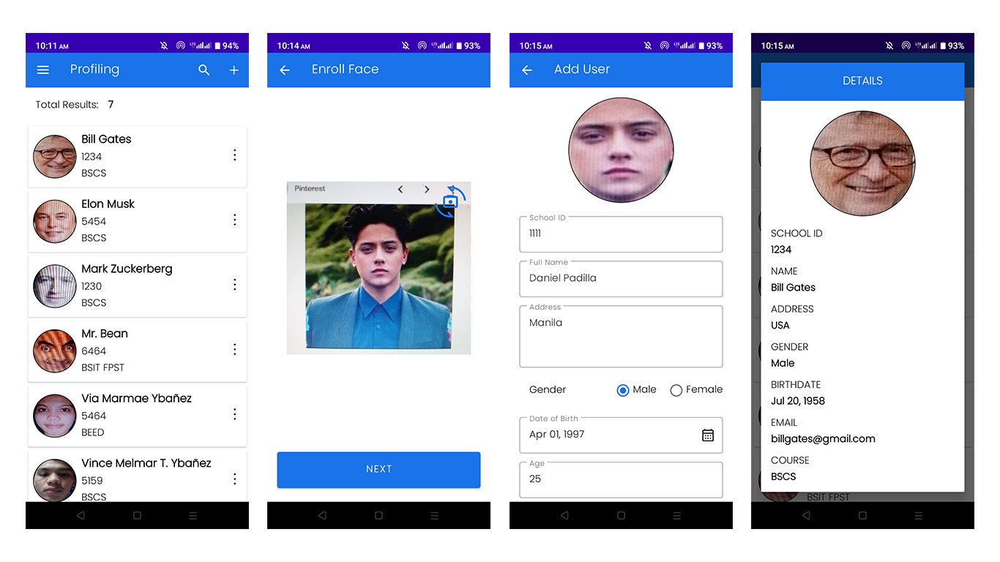
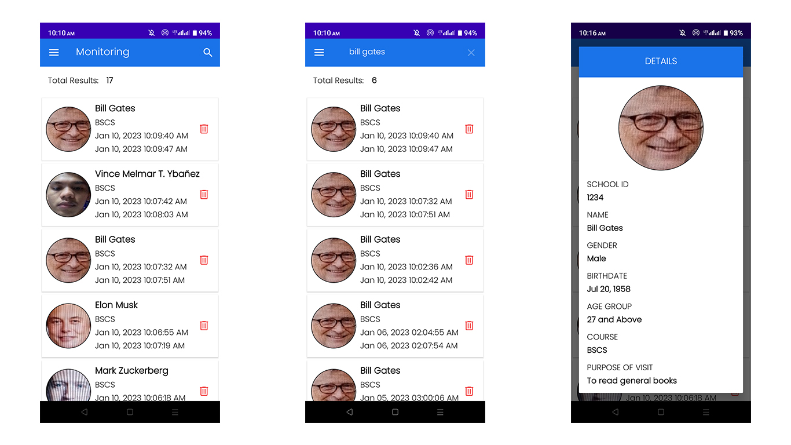
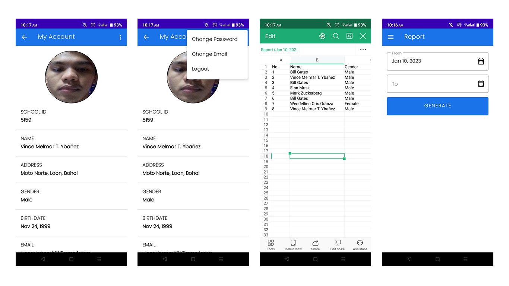

# User Monitoring System - BISU Calape Library using Face Recognition

> An android application for monitoring users of BISU Calape library using face recognition.

## Preview

## Author

[Dev Vince](https://devvince.pages.dev/)

## Acknowledgement

[Real time face recognition with Android + TensorFlow Lite](https://medium.com/@estebanuri/real-time-face-recognition-with-android-tensorflow-lite-14e9c6cc53a5)
